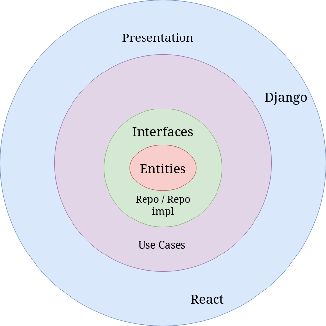

# Introduction

I'm doing this application in clean architecture, since the application is small and i don't have a more 
clear context of the business rules, i decided to split as i would imagine this cenario 

## Clean Architecture overview image

## This project Architecture

## Tecnology Stack
* Django 
* React

## Repo - Repositories 

  > Interfaces Definitions
  * QrCodeGen
      * gen()
      * gen_url()

## Repo_impl - Repositories implementation
  > Concrete classes
  * QrCodeGen
      * gen()
      * get_url()  

## Entities
    linkedin
    github
    Person
    * Has a linkedin
    * Has a github

## Use Cases
    *   GenerateQrCode
    *   RedirectQrCode
    *   GetPersonInfo

# Django Api
## Request example:
## QR CODE
> /api/?name=john&surname=william&lastname=Oliver&age=21&aboutme=loremipsum&githubuser=john&githubcontribuitions=300&linkedinuser=oliverwilliam

## PERSON INFO
> api/personDisplayData?name=john&surname=william&lastname=Oliver&age=21&aboutme=loremipsum&githuburl=https://github.com/john&linkedinurl=https://www.linkedin.com/in/oliverwilliam

## Video application demo
    https://www.youtube.com/watch?v=vWYBr9Zx6GE

## How to test
run pip install django
run pip install qrcode
if there's a error like a missing dependency, just run pip install {dependency}
Go to QrCodeData_django and execute python manage.py 7000, the port has to be 7000
Go to qrcodedata_react and run npm install and npm run dev
fill in the form and click generate, it will generate qrcode
theres a video too that demonstrate the application